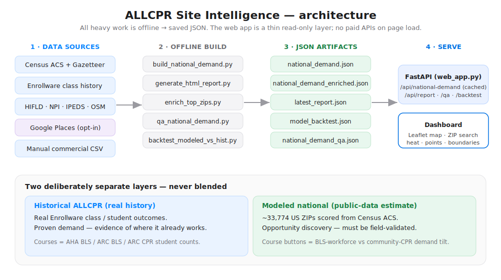

# ALLCPR 选址智能引擎

一套模块化流水线，帮助 **ALLCPR** 识别适合开设 CPR / BLS / 急救培训中心的潜力区域。
它采集带来源标注的需求信号、竞争信号、可达性代理指标与经济背景数据，然后用
Markdown、CSV、JSON 以及可选的打印友好型 HTML 报告对候选区域进行排名。

> **准确性是工程化得来的，而非空口宣称。** 数值要么来自标注来源，要么标记为
> `unknown`（未知）。学员数 / 营收区间一律标注为 `estimated`（估算）。商业租金在没有
> 标注来源覆盖值的情况下保持 `unknown`。

**在线演示：** https://allcpr-site-intelligence.onrender.com （免费实例 —— 首次加载可能冷启动约 30 秒）

---

## 架构一览



本产品始终保持**两个刻意分离的数据层**，从不混合：
**ALLCPR 历史层**（来自 Enrollware 的真实成单结果 —— 已验证的需求）与**全国建模层**
（基于公开数据、覆盖约 33,774 个美国 ZIP 的估算 —— 用于机会发现，必须经过实地验证）。

---

## v2.0 新特性 —— 扩展至 11 项的 Places 富集

v2.0 通过更完整地刻画**医疗需求密度**与**培训 / 竞争生态**，让
**ALLCPR 选址智能仪表盘**在选址判断上更准确。早期方法仅查询 4 个狭窄的 POI 类别，
系统性地低估了实际情况（医疗约低估 2.2×、培训约低估 3.3×）。v2.0 将其扩展为
**11 项 Places 查询**，分属三大信号族，并对全部 **2,694 个优先 ZIP** 重新富集。

### 方法论：4 类别 → 11 查询

| | 旧（4 类别） | 新（11 查询） |
|---|---|---|
| **医疗** | 医院 · 急诊护理 · 养护机构 | 医院 · 急诊护理 · **诊所** · **医生诊室** · 养护机构 |
| **培训** | —— | CPR 培训中心 · **EMT 学校** · **医助培训学校** · 护理学校 |
| **竞争** | CPR 竞争者 | **BLS / CPR 竞争者** · **急救认证** · 相关培训机构 |

扩展后的集合 = 每个 ZIP **5 医疗 + 4 培训 + 2 竞争** 项 Places 查询
（`scripts/enrich_top_zips.py` → `CATEGORY_QUERIES`）。它们驱动
`healthcare_facility_density`、`training_school_density`、`competition_gap_score`
以及 ZIP 详情中展示的各类别计数。

### 本次发布的变更

- **`national_demand_enriched.json`** —— 全部 2,694 个优先 ZIP 已用扩展后的数值刷新
  （替换了原狭窄查询造成的低估值）。
- **重新生成的服务产物** —— `zip_details.jsonl` + `zip_details_index.json`
  （可按字节偏移定位的 ZIP 详情存储）与 `national_demand_lite.json[.gz]`（轻量全国地图层）。
  **Render 通过索引从 `zip_details.jsonl` 提供 ZIP 详情，而非读取 77 MB 的富集大文件**，
  因此新数值通过该定位路径在生产环境中呈现。
- **对全局 Places 故障的优雅中止** —— `scripts/enrich_top_zips.py` 会记录进度断点，
  在配额 / 计费错误（HTTP 429 / 403）时干净地停止，而不是对每个 ZIP 反复重试同一故障；
  `--resume` 可继续。
- **Render 上的持久缓存磁盘**（`render.yaml`）—— 在 `data/cache` 挂载一块 2 GB 磁盘，
  让响应缓存在重新部署 / 重启后依然存在。没有它，Render 的临时文件系统会在每次部署时
  清空缓存，迫使全量重新抓取；有了它，已有的 30 天 TTL 决定刷新时机，数值保持稳定。

### 经实时定位路径验证

| ZIP | 医疗密度 | 培训密度 |
|-----|--------:|--------:|
| 07030 | 68.9 | 56.8 |
| 10016 | 160.3 | 127.5 |
| 95112 | 12.0 | 8.3 |

数值已通过 `GET /api/zip-demand/{zip}` 端到端确认（即生产环境
`_load_zip_detail` 对 `zip_details.jsonl` 的字节偏移定位读取）。

---

## v1.0 新特性（加固版）

- **全国需求 QA 流水线** —— `scripts/qa_national_demand.py` 写出
  `national_demand_qa.json`（覆盖率、置信度与得分分布、可疑离群点检测、按州汇总），
  通过 `GET /api/national-demand-qa` 提供，可从仪表盘导出（"Export QA JSON"）。
- **更快的全国端点** —— `GET /api/national-demand` 以输入文件签名为键缓存其约 3.4 万行的
  注释化负载，将重复加载从约 1.3 秒降到约 0.4 秒。数据文件重建后缓存自动失效。
- **更稳健的地图渲染** —— 放大时热力与 ZIP 点的不透明度依然清晰可读（旧版淡出过于激进）；
  提供 Light / Normal / Strong 三档强度。
- **扩展的全国富集** —— `scripts/enrich_top_zips.py` 将完整全国集合过滤为有用候选
  （存在坐标、人口下限、除非高需求否则要求密度、ACS 完整度、最低分），并以批处理、
  缓存、断点续跑的方式富集优先 ZIP。已保存的运行在 2,694 个富集优先 ZIP 处完成；
  除非按州、客户或检索请求，否则不要强制富集其余低优先 ZIP。

  ```bash
  # 仍可对指定请求的 ZIP 手动强制富集。
  python scripts/enrich_top_zips.py --use-places --zips 94541 --max-api-calls 4
  ```

  新增参数：`--min-population`、`--resume`、`--batch-size`（与
  `--min-score`、`--top-n`、`--state`、`--max-api-calls`、`--dry-run` 并列）。每个 ZIP
  消耗 4 次带缓存的 Places 调用；`--dry-run` 在不发起任何调用的情况下预览候选数量与
  预估成本。
- **Places 抽检方案** —— `data/processed/spot_check_zips.json`：一份精选的 10-ZIP 测试集
  （附原因），用于安全、有预算控制的 Places 试跑。

---

## 第二阶段特性

- **高管决策报告** —— 每份 Markdown/HTML 报告开头都有一段高管结论（最佳候选、结论、
  扩张就绪度、最大风险、最佳策略、置信度、签约前需验证什么），外加建议的接下来 3 步行动，
  让读者约 15 秒即可决策。
- **报告样式** 通过 `--report-style executive|detailed|debug`（默认 `executive`）：简洁的
  决策视图、完整的丰富表格，或完整的原始诊断。无论如何，JSON/CSV 始终保留完整明细数据。
- **确定性的解读层**（`app/reports/interpretation.py`）：扩张就绪度（Strong / Moderate /
  Weak 并附原因）、按业务重要性排序的需求信号、市场进入策略标签、竞争者市场解读、
  通俗易懂的告警、得分量表、以及每个候选的速读 —— 全部由采集到的信号确定性推导，绝不臆造。
- **策略契合过滤** 通过 `--fit-strategy` —— 仅保留其建议的市场进入策略与 ALLCPR 选定打法
  匹配的区域（例如 `--fit-strategy nursing,hospital`）。仅过滤 Markdown/HTML 报告；
  JSON/CSV 保持完整。
- **仪表盘 HTML 报告** 来自 `scored_locations.json`：吸顶的高管摘要、带色的分级 / 就绪度徽章、
  样式化得分条、紧凑的来源审计（附可折叠的逐字段附录），适配移动端与打印。
- **租金覆盖模板生成器**（`scripts/generate_rent_template.py`）：依据评分报告自动构建
  `rent_overrides.csv` 骨架；`--merge` 会保留已填入的租金值。
- **都会对比模式** 通过 `--mode metro_comparison`，把城市、街区、走廊作为粗粒度区域比较，
  而非密集的就近网格点。
- 都会对比输出中的**城市级与候选级排名**。
- **就近候选去重**，使报告不再出现几乎相同位置的聚集。
- **安全的竞争者网站分析**，仅针对主页加上至多一个明显的课程 / 预订页面。
- **基于真实 / 代理信号的可达性评分**：高速 / 主干道、公交、机场 / 商业走廊、购物广场、
  停车代理、步行性代理。除非有直接支撑，精确停车信息保持 `unknown`。
- **紧凑的来源审计**（Markdown 与 HTML）—— 一张汇总表把重复记录（如大量竞争者网站抓取）
  聚合为单一家族行；完整的逐字段附录可折叠（`debug` 样式）。
- **租金覆盖支持** 通过 `data/raw/rent_overrides.csv`。
- **公开招聘的认证需求** 通过 `data/raw/job_postings.csv`，扫描标注来源的招聘信息中的
  BLS、CPR、急救、AHA / 红十字会、ACLS、PALS 及职位关键词。
- **Google Places API v1 迁移规划**，同时把遗留调用隔离在采集器方法之后。

第一阶段行为依然有效：`--mode city` 仍是默认的城市网格工作流，既有基于 `PlaceProfile`
的报告保持兼容。

---

## 第三阶段特性

第三阶段解决第一 / 二阶段在旧金山遇到的"每个密集都会候选都打 71–76 分"失效模式 ——
锚点并非现实中的商业点位、得分压缩在极窄区间、报告无法解释*为何*一个候选胜过另一个。

- **同类组 z 分数归一化**（`app/scoring/cohort_normalization.py`）。候选评分后再跑一遍，
  对饱和的子分（需求、培训、竞争空白、机会）计算同类组均值 / 标准差，将每个候选的绝对分
  与经 sigmoid 映射的 z 分数融合（默认 `--cohort-blend 0.5`），并重算 `site_score`。
  以前 `site_score` 仅跨 4 分的旧金山密集同类组，如今可跨 15–20 分。
- **普查区级人口统计**（`app/collectors/census.py`）。坐标解析现在优先尝试 Census Tract
  （具体街区），再到 Incorporated Place，最后到 County。以前每个旧金山候选都继承全市的中位
  收入与年龄 —— 现在各自落入有独立人口画像的不同普查区。
- 报告中的**因子分解**。每个候选都有一段"此候选 site score 相对同类组的驱动因素"，
  列出哪些子分把 site_score 拉到同类组均值之上或之下，并展示 `delta × weight = contribution`
  的算式。
- 每个候选标题上的 **Δ-相对同类组均值徽章**
  （`Δ vs cohort mean +2.4 (Above cohort mean)`），即便绝对跨度很窄，读者也能立即看出相对位置。
- **三个新置信度维度**（在原有六个之外）：
  - `saturation` —— 当许多需求类别触及 Google Places 单页 20 条结果上限（真实计数未知）时下降。
  - `catchment_overlap` —— 当 ≥60% 的候选共享其前 5 名竞争者（排名是在和同一批竞争者较劲）时下降。
  - `differentiation` —— 当同类组 `site_score` 变异系数低于 2%（算法无法区分候选）时下降。
- **密集都会自动识别**（`app/utils/density_probe.py`）。在配置半径内，对每个目标做一次
  CPR 竞争者探测。当存在 ≥20 家机构时，流水线会在生成候选网格*之前*自动把半径缩到 2 英里、
  网格间距缩到 0.6 英里，让旧金山 / 纽约 / 洛杉矶不再混淆街区。`--no-dense-mode` 可关闭。
- **基于 OSM 的商业区候选过滤**（`app/collectors/osm_zoning.py`）。免费的 Overpass 查询获取
  `landuse=commercial|retail` 多边形。落在住宅或工业地块的网格点会在锚点查找前被剔除。
  `--no-osm-zoning` 可关闭；当 OSM 覆盖稀疏时优雅回退。
- **Foursquare 锚点来源**（`app/collectors/foursquare_places.py`）。锚点选择时先于 Google 尝试：
  Foursquare 干净的分类法能清楚区分购物中心 / 商业街 / 写字楼 / 联合办公 / 医疗中心 / 医院，
  而 Google 的 `establishment + point_of_interest` 做不到。已迁移至
  `places-api.foursquare.com`，使用 2024 年后的 Bearer 认证 + `X-Places-Api-Version` 头部。
  以 `FOURSQUARE_API_KEY` 作为特性开关。
- **Yelp Fusion 竞争者交叉验证**（`app/collectors/yelp_competitors.py`）。对每个候选，跨
  `cprclasses,firstaidclasses` 类别做一次 Yelp 检索。以名称分词 Jaccard ≥ 0.5 + 大圆距离
  ≤ 80 米匹配。为匹配到的 Google 竞争者补充 `yelp_rating` / `yelp_review_count` /
  `yelp_categories`；仅出现在 Yelp 的竞争者会加入池中并在来源审计中呈现。以 `YELP_API_KEY`
  作为特性开关。
- **Adzuna 实时招聘证据**（`app/collectors/adzuna_jobs.py`）。每个候选做五桶按角色分类的检索
  （临床 / EMT / 护理助理 / 牙科 / 托育）。结果在客户端过滤出提及 BLS / CPR / AHA / 急救者，
  再与手工的 `data/raw/job_postings.csv` 合并 —— 冲突时 CSV 始终胜出，因为标注来源的招聘比
  算法检索命中更可信。以 `ADZUNA_APP_ID` + `ADZUNA_APP_KEY` 作为特性开关。
- **驾车时间等时圈** —— 同一接口背后有两个可互换的提供方。**OpenRouteService**
  （`app/collectors/openrouteservice_isochrones.py`，`ORS_API_KEY`）免信用卡（邮箱注册，
  500/天）且优先尝试；**Mapbox**（`app/collectors/mapbox_isochrones.py`，`MAPBOX_TOKEN`）为回退。
  当 `--catchment-minutes >0` 时，每个候选获得一个驾车时间多边形；服务区过滤会把需求 + 竞争者
  记录后修剪为多边形内的部分并重算桶内计数。从 Mission 锚点出发的 10 分钟车程不会越过海湾；
  一个 5 英里的圆圈则会。
- **加固的候选可行性过滤**（`app/utils/viability_filter.py`）。硬性屏蔽公交站点
  （BART / 公交 / 地铁 / 轻轨）、路口（`Hayes St & Divisadero St` 样式的名称）、
  `NOT A PUBLIC STOP` 标记、停车场、机场航站楼、政府办公点、救护车停靠区、来自逆地理编码
  回退的 Plus Codes，以及许多重工业名称模式。通过屏蔽但缺乏商业信号的锚点（如 "Pinterest"
  这类企业总部）会在报告中标记为"需要商业点位验证"，而非当作已确认的商业点位。

---

## 安装

```bash
git clone <this repo>
cd allcpr-site-intel
python -m venv .venv && source .venv/bin/activate
pip install -r requirements.txt
cp .env.example .env
```

在 `.env` 中设置 `GOOGLE_MAPS_API_KEY`（唯一必填的密钥）。Census 密钥可选。第三阶段集成
（Foursquare、Yelp、Adzuna、Mapbox）全部可选且由特性开关控制 —— 见"环境变量"一节。
仅凭 Google + Census + 免费的 OpenStreetMap，流水线即可完整运行。

## 环境变量

### 核心

| 变量 | 必填 | 用途 |
|---|---:|---|
| `GOOGLE_MAPS_API_KEY` | 是 | Places + Geocoding API。计费（Maps Platform 每月给 $200 免费额度；约 6,250 次 Nearby/Text 检索后才付费）。 |
| `CENSUS_API_KEY` | 否 | 免费；提高 ACS 速率上限。 |
| `BLS_API_KEY` | 否 | 预留给未来劳动力数据集成。 |

### 第三阶段 —— 可选集成（全部特性开关化；不配也能运行）

| 变量 | 免费额度 | 启用的能力 |
|---|---|---|
| `FOURSQUARE_API_KEY` | 免费 service-API 档约 1k 次/天 | 锚点选择*先于* Google 使用 Foursquare 干净的购物中心 / 写字楼 / 医疗中心分类法。 |
| `YELP_API_KEY` | 500 次/天 | 针对 Yelp `cprclasses,firstaidclasses` 类别的竞争者交叉验证。为 Google 竞争者补充 Yelp 评分 / 评论数 / 仅 Yelp 新增项。 |
| `ADZUNA_APP_ID` + `ADZUNA_APP_KEY` | 试用档 250 次/月（美国） | 过滤出提及 BLS / CPR / AHA / 急救 的实时医疗类招聘；与手工的 `job_postings.csv` 合并。`ADZUNA_COUNTRY` 默认 `us`。 |
| `ORS_API_KEY` | 500 次等时圈请求/天，**仅邮箱注册 —— 无需信用卡** | `--catchment-minutes >0` 时的驾车时间服务区。基于 OpenStreetMap。先于 Mapbox 尝试。推荐提供方。 |
| `MAPBOX_TOKEN` | 10 万次/月，**但激活需要信用卡** | 同样的等时圈服务区；仅在未设置 `ORS_API_KEY` 时使用。 |

### 行为开关

| 变量 | 默认 | 作用 |
|---|---|---|
| `SAFE_PHOTO_URLS` | `true` | 从保存的报告中剥除带 API 密钥的图片 URL。 |
| `COMPETITOR_HYDRATE_TOP_N` | `5` | 用 Google Place Details 补全的前 N 名竞争者。 |
| `COMPETITOR_WEBSITE_ANALYSIS_ENABLED` | `true` | 安全的逐竞争者主页分析。 |
| `COMPETITOR_WEBSITE_TIMEOUT` | `5` | 每个竞争者网站抓取的秒数。 |
| `METRO_DEDUPE_DISTANCE_MILES` | `1.0` | 都会对比模式下的就近候选去重阈值。 |
| `OSM_ZONING_ENABLED` | `true` | 设为 `false` 可完全跳过 OSM 商业区过滤。 |
| `OVERPASS_URL` | 公共实例 | 覆盖 Overpass 端点（高频运行请用自建实例）。 |
| `AVG_CPR_COURSE_PRICE` / `AVG_BLS_COURSE_PRICE` | `85` / `95` | 营收估算模型输入。 |

### 诚实的 API 成本矩阵

| API | 永久免费？ | 何处花钱 |
|---|---|---|
| Google Places（遗留 v3） | $200/月额度 → 约 6k–11k 次/月 | 首个都会未命中缓存的运行约 $5–8。缓存把重跑降到约 $0。 |
| Google Geocoding | 同一 $200 额度 | 便宜；每个目标 1 次调用。 |
| Census ACS | 是 | 无 |
| OpenStreetMap / Overpass | 是（公共实例有限速） | 自建需服务器成本 |
| BLS | 是（有密钥，500/天） | 无 |
| Foursquare | 约 1k/天免费 | 超出免费档按次计价，价格不一 |
| Yelp Fusion | 500/天免费 | 付费档需联系销售 |
| Adzuna | 试用 250/月免费 | 更高量需付费套餐 |
| OpenRouteService | 500/天免费，无需信用卡 | 更高量需自建 |
| Mapbox | 10 万/月，但启动需信用卡 | 之后约 $0.50–$2 / 千次 |
| 商业地产（CoStar、CompStak、Reonomy） | 否 | $$$ —— 在预算到位前用 `data/raw/rent_overrides.csv` 作为标注来源 |

---

## 运行流水线

### 单一地址

```bash
echo "1631 N First St San Jose 95112" > /tmp/target.txt
python scripts/full_pipeline.py \
  --mode single_address \
  --cities /tmp/target.txt \
  --state CA \
  --radius-miles 2 \
  --grid-spacing-miles 0.5 \
  --max-candidates 6 \
  --output data/reports/n_first_st_report.md \
  --csv-output data/scored/scored_locations.csv \
  --json-output data/scored/scored_locations.json
```

### 单一城市

```bash
python scripts/full_pipeline.py \
  --mode city \
  --cities examples/target_cities.txt \
  --state CA \
  --radius-miles 5 \
  --output data/reports/allcpr_site_report.md
```

### 都会对比

新建一个文件，每行一个城市、街区或走廊：

```text
Downtown San Jose, CA
Milpitas, CA
El Camino Real corridor, Santa Clara, CA
Fremont medical district, CA
```

运行：

```bash
python scripts/full_pipeline.py \
  --mode metro_comparison \
  --cities examples/target_cities.txt \
  --state CA \
  --radius-miles 5 \
  --report-style executive \
  --output data/reports/metro_comparison.md \
  --csv-output data/scored/scored_locations.csv \
  --json-output data/scored/scored_locations.json \
  --html-output data/reports/metro_comparison.html
```

都会模式对每个目标行评估一个粗粒度候选，使用 `--dedupe-distance-miles` 或
`METRO_DEDUPE_DISTANCE_MILES` 去重就近目标，并输出城市 / 区域排名和候选排名。

### 报告样式与策略过滤

两个可选参数塑造 Markdown/HTML 报告。无论用哪个，JSON 与 CSV 始终保留完整明细数据。

| 参数 | 取值 | 作用 |
|---|---|---|
| `--report-style` | `executive`（默认）、`detailed`、`debug` | `executive` 简洁可决策；`detailed` 保留完整丰富表格；`debug` 增加原始的逐字段来源审计与诊断。 |
| `--fit-strategy` | 逗号分隔的策略键 | 仅保留其建议市场进入策略匹配的区域。只要某区域前 3 名策略中**任意一个**匹配**任意一个**键即保留。 |

`--fit-strategy` 的策略键：`nursing`、`hospital`、`ems-fire`、`airport`、`childcare`、
`weekend`、`multilingual`、`partnership`。

```bash
# 仅展示契合护理学员或医院 BLS 打法的区域
python scripts/full_pipeline.py \
  --mode metro_comparison \
  --cities examples/bay_area_neighborhoods.txt \
  --state CA \
  --radius-miles 2 \
  --report-style executive \
  --fit-strategy nursing,hospital \
  --output data/reports/neighborhood_comparison.md \
  --html-output data/reports/neighborhood_report.html
```

### 第三阶段 CLI 参数

全部可选；不带参数时默认值会复现合理行为。

| 参数 | 默认 | 作用 |
|---|---|---|
| `--cohort-blend` | `0.5` | 同类组相对 z 分数相对绝对分的权重（`0.0`=仅绝对，`1.0`=仅同类组）。仅在候选 >1 时生效。 |
| `--no-cohort-normalization` | 关 | 仅用绝对分（遗留评分）。 |
| `--no-dense-mode` | 关 | 关闭密集都会自动识别（即便在 SF/NYC/LA 也保持配置半径）。 |
| `--dense-threshold` | `20` | 触发密集都会模式所需的、配置半径内的 CPR 竞争者数量。 |
| `--no-osm-zoning` | 关 | 跳过对候选网格点的 OSM 商业区过滤。 |
| `--osm-zone-buffer-meters` | `250` | 网格点若在商业多边形内或距其此范围内则保留。 |
| `--catchment-minutes` | `0` | 当 `>0` 且设置了 `MAPBOX_TOKEN` 时，为每个候选获取驾车时间等时圈并把需求/竞争者后过滤到圈内。`0`=圆形半径。 |
| `--catchment-profile` | `driving` | Mapbox 路由模式：`driving`、`driving-traffic`、`walking`、`cycling`。 |
| `--keep-non-viable` | 关 | 保留锚点为纯工业 / 非商业的候选（默认会将其从排名报告中剔除）。 |

```bash
# 带驾车时间服务区的密集都会运行（需要 MAPBOX_TOKEN）
python scripts/full_pipeline.py \
  --mode city --cities sf_target.txt --state CA \
  --radius-miles 7 --grid-spacing-miles 2 --max-candidates 10 \
  --catchment-minutes 10 --catchment-profile driving-traffic \
  --report-style executive \
  --output data/reports/sf_report.md \
  --html-output data/reports/sf_report.html
# 密集模式自动识别会在生成网格前把 7 英里缩到 2 英里。
```

### 由现有 JSON 生成 HTML

```bash
python scripts/generate_html_report.py \
  --input data/scored/scored_locations.json \
  --output data/reports/allcpr_site_report.html
```

当 `SAFE_PHOTO_URLS=true` 时，HTML 输出会剥除明显的 API 密钥 / 令牌查询参数，且绝不内嵌
Google 图片 URL。

生成 HTML 报告（或带 `--html-output` 的完整流水线运行）还会写出
`data/processed/latest_report.json` —— 即 Web 仪表盘读取的机器可读负载。没有第二条评分路径：
它由渲染 HTML 所用的同一份报告上下文构建。

---

## Web 仪表盘（交互地图 + ZIP 检索）

一个可选的 FastAPI 应用（`web_app.py`）提供浏览器仪表盘，用于决定在何处开设或试点新的
CPR/BLS 中心。它是**只读**的：加载预先生成的 `data/processed/latest_report.json`，在页面
加载时绝不重新评分或调用外部 API。

仪表盘以**地图优先**（Apple 风格），有**两个清晰分离的数据层**供你切换 —— 它们绝不被混合
成一个数字：

| 层 | 来源 | 覆盖 |
|-------|--------|------|
| **ALLCPR 历史** | 真实的 Enrollware 课程 / 学员历史 | 你教过的 ZIP |
| **全国建模需求** | 公开的 Census ACS 估算（见下） | 每个美国 ZIP（约 3.3 万） |

特性：

- 课程选择器（**Overall / AHA BLS / ARC BLS / ARC CPR**）。在历史层这些是真实学员数；
  在建模层它们是需求*倾向*（BLS = 医疗劳动力，CPR = 社区）—— 品牌（AHA vs ARC）**不**由
  公开数据建模，并明确标注。
- 历史层 = 离散的可点击圆形标记；建模层 = 覆盖全部约 3.3 万 ZIP 的 Leaflet 热力面
  （首次切换时懒加载）。
- 两层均支持 ZIP 检索 + 点击查看；底部洞察面板含 ZIP 详情、高管摘要、候选点位，以及可展开的
  方法论 / 注意事项。
- 每个 ZIP 标注数据质量分级：**真实历史** → **建模（基线）** → **富集**
  （基线 + Places/Routes/竞争者/商业验证，后续为优先 ZIP 添加）。

### 全国建模需求层

`scripts/build_national_demand.py` 是一个**离线批处理**（绝不在页面加载时运行），仅用公开数据
为每个美国 ZIP 评分 —— Census ACS 五年 ZCTA 人口统计（人口、密度、收入、劳动年龄/就业、教育、
医疗行业就业）+ Census Gazetteer 陆地面积 —— 得到 0–100 的**建模机会估算**。它写出
`data/processed/national_demand.json`。

```bash
# 全量全国构建（下载 gazetteer + 一次批量 ACS 拉取，然后评分）：
python scripts/build_national_demand.py

# 快速开发子集：
python scripts/build_national_demand.py --limit 500
```

它是**决策支持估算，而非真实报名历史**，并与历史数据分别存放于不同的文件 / 端点 / 地图层。
课程倾向估算需求**类型**（BLS 劳动力 vs 社区 CPR），**而非** AHA-vs-ARC 品牌偏好 —— 没有任何
公开数据集编码品牌信息。

**前向兼容的数据结构（第二阶段）。** 每个建模 ZIP 行可选携带以下富集字段。第一阶段省略它们
（精简的 3.3 万行文件）；离线富集任务为每个高优先 ZIP 提供它们，凡是同时作为评分信号的字段
都会触发重新排名，该行的 `tier` 翻转为 `enriched`，仪表盘随即渲染它们 —— **无需重写仪表盘或
公式**：

```
healthcare_facility_count  urgent_care_count        hospital_count
nursing_school_count       college_count            childcare_count
ems_fire_count             competitor_count         competitor_density
avg_competitor_rating      competitor_schedule_count drive_time_access_score
parking_score              commercial_space_available estimated_rent
rent_source                enrichment_tier          enrichment_sources
enrichment_updated_at
```

挂钩点是 `scripts/build_national_demand.py` 中的
`build_national_payload(..., enrichment_by_zip=...)`；描述性字段列于
`ENRICHMENT_DESCRIPTIVE_FIELDS` / `ENRICHMENT_META_FIELDS`。所有重型富集
（Places、Routes、竞争者、商业）都**离线**运行并保存为 JSON —— 绝不在页面加载时调用。

### 本地运行仪表盘

```bash
# 1. 生成历史报告数据（写出 data/processed/latest_report.json）
python scripts/generate_html_report.py \
  --input data/scored/scored_locations.json \
  --output data/reports/allcpr_site_report.html

# 2.（可选）构建全国建模层（写出 data/processed/national_demand.json）
python scripts/build_national_demand.py

# 3. 启动仪表盘服务
uvicorn web_app:app --host 0.0.0.0 --port 8000
# 打开 http://localhost:8000
```

API 路由：`GET /health`、`GET /api/report`、`GET /api/zip-demand`、
`GET /api/national-demand`、`GET /api/model-backtest`、`GET /`。若某负载缺失，该端点返回
有帮助的 404，告诉你该运行哪个构建步骤。响应经 gzip 压缩（全国层约 15 MB 原始 → 约 1.3 MB
传输）。

仪表盘是一个**地图优先、带标签页底部抽屉**的 UI：

- **图层选择器** —— ALLCPR 历史 vs 全国建模；**课程选择器** —— Overall / AHA BLS / ARC BLS /
  ARC CPR；**ZIP 检索** + 点击查看。
- **ZIP 标签页** —— 得分、历史、商业现实、一个决策标签
  （`Strong test area` / `Possible opportunity` / `Keep watching` /
  `Lower priority` / `Commercially promising — validate in person`）、一段"为什么"、
  后续步骤与风险标记。绝不出现"立即开店"。
- **对比标签页** —— 把至多 5 个 ZIP（历史或建模）加入并排表；移除 / 清空 / **导出 CSV**
  （浏览器端，无服务器参与）。
- **验证标签页** —— 建模 vs 历史回测（相关性 / R² / 假阳假阴）并附小样本注意事项；外加
  方法论与数据分级图例。

### 商业验证（手工 CSV）

一个 ZIP 可能得分很高却并不实际可行（租金、停车、没有可容纳教室的空间、无房可租）。把已验证的
空间放入 `data/manual/commercial_validation.csv`，仪表盘会在所选 ZIP 上展示它们，并在存在带
停车与教室适配的可用空间时，（谨慎地）把 `Strong test area` 升级为
`Commercially promising — validate in person`。Web 应用在请求时按 ZIP 合并此 CSV —— 无需重建。
参见 [`data/manual/commercial_validation.example.csv`](data/manual/commercial_validation.example.csv)。

```csv
zip,address,property_name,sqft,monthly_rent,parking,available,classroom_fit,source_url,broker_contact,notes,updated_at
95112,123 Example St,Example Plaza,900,3200,Yes,Yes,Good,https://example.com,John Broker,Good parking,2026-06-11
```

文件缺失 → 空操作；坏行会被跳过并告警；租金可从 `$3,200` 样式字符串解析。不抓取 LoopNet/Crexi
—— 仅手工录入。

### 第二阶段富集（离线，针对顶部 ZIP）

`scripts/enrich_top_zips.py` 为某课程选出最强的 ZIP 并仅富集这些，写出
`data/processed/national_demand_enriched.json`（存在时优先被 `/api/national-demand` 采用）。
商业验证如今从 CSV 合并；**Google Places 已接入** 在 `--use-places` 之后（默认关闭 —— 它要花钱）。
经手工商业验证的 ZIP 无论排名如何始终富集。

```bash
# 默认：不做实时 API 调用（仅商业验证富集）
python scripts/enrich_top_zips.py \
  --input data/processed/national_demand.json \
  --output data/processed/national_demand_enriched.json \
  --top-n 100 --course aha_bls --state CA --dry-run

# 为小规模决赛 / 背景实验启用实时 Google Places：
python scripts/enrich_top_zips.py --use-places --zips 95112,97202 --max-api-calls 40
```

`--dry-run` 选取并记录预估 API 调用但不写入；`--max-api-calls` 限制批量；`--use-places` 启用
实时（带缓存）Google Places —— 每个 ZIP 4 次 `nearby_search`（医院、急诊护理、护理学校、竞争者），
用于决赛背景。Places 仍可产出实验性的、形似评分的字段
（`healthcare_facility_density`、`training_school_density`、`competition_gap_score`），但基于
Places 的得分变化**不是**默认的全国评分引擎，必须留在显式的、受回测把关的实验之后。
已提交的富集输出有意为优先 ZIP 覆盖，而非全 ZIP 覆盖：**优先 ZIP 提供富集验证。**
**页面加载时绝不运行昂贵的 API 调用** —— 只有这个离线脚本做重活。

> **回测发现（实时 Places，n=30 重叠 ZIP）：** Places 富集**没有**改善与真实历史的一致性 ——
> 总体相关性 0.103 → 0.105（噪声）。根因：`nearby_search` 单页上限 20 条，因此在密集 ZIP 中
> `hospital_count` / `competitor_count` 在 20 处饱和并失去区分度。故 Places 默认**关闭**。
> 要让它有用，先去饱和这些计数（分页，或用 HIFLD/NPI 这类批量设施数据集），再重跑回测后才信任它。

### Places 回测后的策略

实时 Google Places 评分实验并未显著改善建模准确性：总体相关性仅从 0.103 → 0.105，BLS/CPR
相关性基本持平，平均得分变动很小，而且密集 ZIP 因就近检索每次约 20 条上限而饱和。

**策略变更：** Google Places 不再被当作默认的全国评分引擎。它对决赛背景与验证仍然有用：

- 就近竞争者
- 真实世界商业背景
- 就近的医院、急诊护理、院校与学校
- 对选定决赛 ZIP 的人工审核

把 Places 当作**背景 / 验证 / 展示富集**，除非日后回测显示有意义的准确性提升。把它留在显式
开关之后，例如 `--use-places`、API 候选门、`--max-api-calls`、缓存新鲜度检查
（`--refresh-days` / `enrichment_cache.json`）以及小规模决赛名单。因此湾区 100-ZIP 的 Places
运行是一次回答"Places 是否为选定 ZIP 提供有用背景？"的决赛验证实验，而非将 Places 提升为全国
评分引擎。

要真正提升全国得分，应优先选用可规模化的批量 / 免费数据集：NPI/NPPES 提供方密度、HIFLD
医院/EMS/消防、IPEDS 院校/护理/医疗项目、OSM 批量社区/停车代理，以及真正的 ZCTA 多边形空间连接。
这些能避开 Places 查询上限，并在全国尺度上可重复。

商业验证仍是独立的业务决策信号，因为它回答实际开店问题：租金、停车、教室适配、可租性、
经纪人/来源以及更新日期。它可能把建议措辞升级为 `Commercially promising — validate in person`，
但绝不升级为 `open now`、`lease-ready` 或等价措辞。

架构层级：

| 层级 | 角色 |
|------|------|
| Tier 0 | 覆盖全部 33,774 个 ZIP 的 ACS/Gazetteer 基线 |
| Tier 1 | API 候选过滤剔除弱 ZIP |
| Tier 2 | 批量公开数据集在通过回测门后，于全国尺度改善评分 |
| Tier 3 | Google Places 为决赛者做背景/验证富集 |
| Tier 4 | 商业验证支撑真实开店决策 |

回测门对每个新信号都是铁律：添加/展示该信号，重算建模得分，运行回测，比较相关性/R²/假阳/假阴，
仅当准确性提升、或业务逻辑在不削弱模型的前提下足够有力时才启用评分。

### 批量公开数据富集（比 Places 更推荐）

`scripts/build_bulk_enrichment.py` 用**免费、完整、可下载**的全国数据集富集 ZIP —— 没有逐 ZIP
的 API 成本，也没有压垮 Places 的 20 条饱和上限。它综合：

| 来源 | 采集器 | 逐 ZIP 字段 |
|--------|-----------|----------------|
| **HIFLD** 设施 | `app/collectors/hifld_facilities.py` | 医院 / 急诊护理 / ems-消防 计数、医疗设施密度、最近医院英里数 |
| **NPI / NPPES** 提供方 | `app/collectors/npi_bulk.py`（流式，约 9 GB 安全） | 医疗提供方 / 护士 / 医师 / 诊所 计数、每万人提供方数 |
| **IPEDS** 院校 | `app/collectors/ipeds.py` | 院校 / 护理学校 / 健康项目 计数、在校人数 |
| **OSM / Overpass** | `app/collectors/osm_overpass_facilities.py` | 托育 / 学校 / 社区 计数、停车与商业可达代理 |

各点由 `app/geo/zcta_join.py` 按 ZIP 归并（最近质心；真正的 TIGER 多边形包含判定是已记录的未来
升级项）。输出：`data/processed/bulk_enrichment.json`，以**仅展示**方式合并进
`national_demand_enriched.json`（被 `/api/national-demand` 优先采用）。

```bash
# 离线、确定性 —— 使用 data/reference/bulk_samples/ 中的极小内置样例
python scripts/build_bulk_enrichment.py --sample

# 真实运行 —— 先把下载好的文件放到 data/raw/bulk/ 下（URL 见脚本 docstring），然后：
python scripts/build_bulk_enrichment.py
```

**评分门 —— 这些信号默认仅展示。** 它们出现在 ZIP 面板作为背景，但**不**改变建模得分，与 Places
完全一样。只有当 `scripts/backtest_modeled_vs_historical.py` 证明某信号在真实重叠数据上改善
相关性/R² 后，它才被提升进评分。评估方法：附上它，重算得分
（`build_national_demand.features_for_zip` + `enrich_top_zips` 重评分路径），跑回测并比较。
**当前已启用进评分的信号：** 批量字段一个都没有（本环境证据不足，仅有样例数据）。
**仅展示：** 上述全部批量字段。

### API 候选预过滤（实时 Places 之前）

在运行任何实时 Google Places 富集前，先用离线 API 候选门排除空白、乡村、低人口、低密度、
低需求或低置信度的 ZIP。它只用已保存的建模/批量/历史字段并写出一份 API 预算计划 —— 它**不**
调用 Places：

```bash
python scripts/select_api_candidates.py --top 1000
python scripts/select_api_candidates.py --min-score 60
python scripts/select_api_candidates.py --output data/processed/api_candidates.json
```

只要启用 `--use-places`，实时 Places 富集路径也会默认套用此门。除非显式请求，Places 始终关闭：

```bash
python scripts/enrich_top_zips.py --use-places --zips 94541 --max-api-calls 4
```

### 模型回测（建模 vs 真实历史）

`scripts/backtest_modeled_vs_historical.py` 匹配同时存在于建模层与真实历史中的 ZIP，然后报告
相关性 / R² / 线性拟合以及假阳/假阴 → `data/processed/model_backtest.json`（显示在仪表盘的
验证标签页）。纯 Python 统计，无额外依赖；它有意低调声称（小重叠 / 弱相关会被如实说明）。

回测还会构建一个**历史校准 / 已验证需求**层。`app/scoring/historical_proven_demand.py` 用平均
每班学员、学员体量、满班率、班次置信度以及可得时的趋势之均衡组合，为真实的 ALLCPR ZIP 结果评分。
`app/scoring/model_calibration.py` 随后把建模需求与已验证需求并排展示，标记高估、低估、隐藏机会
与一致情况，并把这些字段暴露给仪表盘。没有 ALLCPR 历史的 ZIP 会得到
`historical_status: "no_allcpr_history"`，不会获得臆造的已验证分数或就近历史代理。

```bash
python scripts/backtest_modeled_vs_historical.py
```

### 在 Render 上部署

- **构建命令：** `pip install -r requirements.txt`
- **启动命令：** `uvicorn web_app:app --host 0.0.0.0 --port $PORT`
- **健康检查路径：** `/health`

仓库含一份开箱即用的 [`render.yaml`](render.yaml)。所有路径都相对于项目根（pathlib），因此不会
有绝对路径泄漏到部署中。提交（或在 Render 构建步骤中生成）你希望站点提供的任意文件 —— 站点只读
已保存的 JSON，页面加载时无昂贵 API：

- `data/processed/latest_report.json` —— 历史层（必需）
- `data/processed/national_demand.json` —— 全国建模层
- `data/processed/national_demand_enriched.json` —— 可选，存在时优先
- `data/processed/model_backtest.json` —— 可选，驱动验证标签页
- `data/manual/commercial_validation.csv` —— 可选，请求时合并

---

## 输出

- Markdown 报告：`data/reports/*.md`
- 可选 HTML 报告：`data/reports/*.html`
- 仪表盘 JSON（历史）：`data/processed/latest_report.json`（由 `web_app.py` 消费）
- 仪表盘 JSON（全国建模）：`data/processed/national_demand.json`（由 `scripts/build_national_demand.py` 构建）
- 仪表盘 JSON（富集，可选）：`data/processed/national_demand_enriched.json`（`scripts/enrich_top_zips.py`）
- 模型回测（可选）：`data/processed/model_backtest.json`（`scripts/backtest_modeled_vs_historical.py`）
- CSV 表：`data/scored/scored_locations.csv`
- 结构化 JSON：`data/scored/scored_locations.json`
- 可选的已保存画像：`data/enriched/*.json`，需配合 `--save-profiles`

无需重新抓取即可重评分已保存画像：

```bash
python scripts/score_locations.py \
  --input data/enriched \
  --output data/scored/scored_locations.csv
```

---

## 竞争者网站分析

该分析器有意做得克制而尊重：

- 仅抓取主页，以及至多一个从主页链接的明显的预订/课程/排期页面。
- 使用请求超时与描述性的 user agent。
- 不广泛爬取、不提交表单、不登录、不绕过 robots/控制，也不使用付费/私有数据。
- 把网络错误当作 `unknown`，而非弱点。
- 仅存储派生信号，不存储页面 HTML。

信号以列表形式存储于：

- `checked`
- `detected`
- `missing`
- `unknown`

检出/缺失字段包括：

- `no_website`
- `online_booking`
- `class_schedule`
- `pricing`
- `multilingual_support`
- `contact_friction`
- `outdated_website`
- `certification_keywords`

报告仅当某弱点出现在已抓取内容的 `detected` 或 `missing` 中时才将其视为有支撑。未抓取或失败的
页面保持 `unknown`。

---

## 可达性模型

`accessibility_score` 现在在可得时使用采集到的可达性区块：

- 高速 / 主干道临近度
- 公交站点临近度
- 机场或商业走廊临近度
- 购物中心 / 广场临近度
- 来自就近停车、广场或商业区的停车代理
- 来自就近地点密度的步行性代理

精确停车存量不做推断。若精确停车未知，报告会如实说明，并把该信号标注为代理。

---

## 租金覆盖 CSV

商业租金不从挂牌网站抓取，也不臆造。要提供带来源标注的租金输入，编辑：

```text
data/raw/rent_overrides.csv
```

必需列：

| 列 | 含义 |
|---|---|
| `city` | 要匹配的城市/区域名，大小写不敏感 |
| `state` | 州缩写 |
| `latitude` | 覆盖中心纬度 |
| `longitude` | 覆盖中心经度 |
| `radius_miles` | 候选必须落在此半径内 |
| `rent_per_sqft_annual` | 每平方英尺年商业租金 |
| `source_url` | 引用 URL 或来源说明 |
| `notes` | 经纪人/挂牌/背景备注 |

示例：

```csv
city,state,latitude,longitude,radius_miles,rent_per_sqft_annual,source_url,notes
San Jose,CA,37.3382,-121.8863,2,42,https://example.com/rent-comp,Broker quote May 2026
```

当候选落在覆盖半径内时，评分输出包含：

- `rent_score`
- `rent_data_confidence`
- `rent_source`
- `rent_notes`

若无覆盖匹配，租金字段保持 `unknown`。

### 租金模板生成器

把每个候选区域的坐标手动抄进 `rent_overrides.csv` 既繁琐又易错。
`scripts/generate_rent_template.py` 自动生成骨架：读取评分 JSON 报告，为每个区域写一行，预填
坐标与 `radius_miles`，并把 `rent_per_sqft_annual` 留空供你从标注来源填入。

```bash
python scripts/generate_rent_template.py \
  --input data/scored/scored_locations.json \
  --output data/raw/rent_overrides.csv \
  --radius-miles 2 \
  --merge
```

使用 `--merge` 时，你已填入的租金值会被保留：当某个已填行位于同一区域的
`--merge-distance-miles`（默认 `0.3`）范围内时，新生成的空白行会被丢弃。生成器从不抓取或臆造
租金值 —— 不存在免费、免抓取的商业租约价格来源，因此该值列始终由你（或带密钥的数据 API）提供。

### 自动租金估算（模型代理，绝非标注报价）

由于不存在免费/合规的商业租金 API，流水线还会从它已采集的数据计算一个**估算**租金信号
（`app/scoring/rent_estimate.py`），与权威的标注覆盖路径严格分离：

- **`rent_pressure_index`（0–100）** —— 始终存在。对候选所在走廊可能多贵的相对估算，来自普查区
  中位收入 + 就近商业/POI 密度 + 竞争者密度 + 商业走廊临近度。即便零租金数据，也能让候选按
  可能成本被*排名*。
- **`estimated_rent_per_sqft`** —— 仅当本次运行的 `rent_overrides.csv` 中至少存在一个**标注**
  租金点后才产出。该指数会线性校准到这些锚点，于是**每个都会一个真实经纪人数值即可把美元估算
  外推到每个候选。** 标注为 `estimated`；绝不当作实测报价呈现。没有锚点时保持 `None` —— 不臆造
  任何美元数字。

这是在免费且合规前提下最接近"自动化租金"的做法：指数全自动；美元校准需要一个标注种子。

---

## ZIP 质心参考（`data/reference/zip_centroids.csv`）

ZIP 级需求解析按半径（`exact_plus_radius`）把就近需求 ZIP 匹配到候选。该匹配只能*看见*质心在
`zip_centroids.csv` 中的需求 ZIP —— 文件中缺失的需求 ZIP 会被静默地从半径匹配中剔除（精确 ZIP
与城市回退仍有效）。流水线现在会记录一条告警，点名任何缺少质心的需求 ZIP，且
`scripts/healthcheck.py` 把同样的覆盖作为一项 **ZIP centroids** 检查报告。

要从**公有领域的 Census ZCTA Gazetteer**（无需 API 密钥、无需信用卡）刷新或扩展该文件：

```bash
# 全国刷新（约 3.3 万 ZCTA）
python scripts/build_zip_centroids.py

# 让提交的文件保持精简 —— 仅你的需求导出所需的 ZIP
python scripts/build_zip_centroids.py --only-demand-zips

# 在不丢弃已有行的情况下追加 ZIP
python scripts/build_zip_centroids.py --only-demand-zips --merge

# 解析你自己下载的文件（离线 / 固定版本）
python scripts/build_zip_centroids.py --from-file ~/2024_Gaz_zcta_national.zip
```

脚本从不臆造质心：GEOID 非 5 位或坐标不可解析的行会被跳过，且它宁可中止也不会用空结果覆盖文件。

## 招聘认证需求 CSV

流水线不抓取招聘网站。要添加真实的 B2B 认证需求证据，把标注来源的公开招聘信息放入：

```text
data/raw/job_postings.csv
```

必需列：

| 列 | 含义 |
|---|---|
| `city` | 要匹配的城市/区域名，大小写不敏感 |
| `state` | 州缩写 |
| `latitude` | 招聘/证据中心纬度 |
| `longitude` | 招聘/证据中心经度 |
| `radius_miles` | 候选必须落在此半径内 |
| `employer` | 公开的雇主名 |
| `title` | 职位名 |
| `description` | 公开招聘文本或摘录 |
| `source_url` | 引用 URL |
| `posted_at` | 已知的发布日期 |
| `notes` | 背景备注 |

示例：

```csv
city,state,latitude,longitude,radius_miles,employer,title,description,source_url,posted_at,notes
San Jose,CA,37.3643,-121.9122,3,Example Hospital,RN,"BLS required. CPR certification from AHA preferred.",https://example.com/jobs/rn,2026-05-20,Public careers page
```

扫描器查找认证关键词：

- `BLS`
- `CPR`
- `First Aid`
- `AHA`
- `American Heart Association`
- `Red Cross`
- `ACLS`
- `PALS`

它还检测角色信号，如护士、EMT、CNA、护工、牙科助理、托育与医疗类角色。输出字段包括：

- `job_certification_demand_score`
- `job_demand_data_confidence`
- `job_active_postings_count`
- `job_certification_postings_count`
- `job_top_employers`
- Markdown/HTML/JSON 中的样例招聘

若未提供标注招聘行，招聘需求保持 `unknown`；系统不臆造招聘需求。

---

## 来源审计

每个候选都携带来自采集器的来源记录。Markdown 与 HTML 会附上一张来源审计表，含：

- 来源名称
- 来源 API / URL
- retrieved_at
- 来源质量
- 已填充字段
- 置信度

来源质量保守分级：官方来源、平台 API、手工覆盖、网页抓取、占位（stub）或未知。占位来源不贡献
置信度。

---

## Google Places 遗留版 vs v1

当前采集器使用遗留的 Places Web Service 端点：

- Nearby Search
- Text Search
- Place Details

这些调用被隔离在 `GooglePlacesClient.nearby_search`、`text_search`、`place_details`、
`hydrate_with_details` 之后。计划中的 v1 迁移是新增一个同级适配器，把 Places API v1 的资源名与
字段掩码映射进现有的 `PlaceProfile` 模型。富集器、评分与报告不应需要知道当前激活的是哪一代
Google Places API。

本第二阶段增加了适配器设计/TODO，但并不强制 v1 迁移，因为遗留路径已经可用且有测试覆盖。

---

## 评分模型

最终 `site_score` 是以下各项的加权和：

| 子分 | 权重 |
|---|---:|
| `demand_score` | 25% |
| `healthcare_training_ecosystem_score` | 20% |
| `competition_gap_score` | 15% |
| `allcpr_opportunity_score` | 15% |
| `economy_score` | 10% |
| `accessibility_score` | 10% |
| `profitability_score` | 5% |

`confidence_score` 单独报告，并可对建议分级设上限。`rent_score` 单独报告；除非未来某阶段有意更改
权重，否则它不影响 `site_score`。`job_certification_demand_score` 也是单独的，但提供时它可以提升
ALLCPR 机会分，因为它是雇主认证需求的直接证据。

### 第三阶段：同类组归一化

每个候选被绝对评分后，`apply_cohort_normalization`（位于
`app/scoring/cohort_normalization.py`）对同类组再跑一遍：

1. 计算饱和子分的同类组均值/标准差
   （`demand_score`、`healthcare_training_ecosystem_score`、
   `competition_gap_score`、`allcpr_opportunity_score`）。
2. 把每个候选的值映射过一个 sigmoid 化的 z 分数，再与绝对分融合
   （`--cohort-blend`，默认 0.5）。
3. 由融合后的子分重算 `site_score`。

这正是把密集都会评分"展平"问题解开的办法。绝对曲线在 Google 单页上限与硬编码类别上限处饱和；
在旧金山每个候选都顶到天花板，于是绝对 `site_score` 落在 4 分的带内。同类组归一化在不臆造数据的
前提下，把同类组内差异重新展开到 15–20 分 —— 单候选运行则完全跳过这一遍（没有可归一化的对象）。

`factor_decomposition` 随后把每个候选相对同类组均值的 Δ 归因到具体子分
（`delta × weight = contribution`），渲染为"此候选 site score 相对同类组的驱动因素"表。

### 置信度维度

`confidence_score` 分解为九个维度（各 0–100）：

| 维度 | 层级 | 含义 |
|---|---|---|
| `demographic` | 逐候选 | 普查区数据完整度 |
| `accessibility` | 逐候选 | 可达性信号覆盖 |
| `rent` | 逐候选 | 是否存在标注的商业租金覆盖 |
| `competition` | 逐候选 | 做了网站分析的竞争者占比 |
| `demand` | 逐候选 | 需求类别覆盖 |
| `data_freshness` | 逐候选 | 来源新鲜度 |
| `saturation` | 逐候选 | 当需求类别触及 ≥20 上限时下降 |
| `catchment_overlap` | 同类组级 | 当候选共享前 5 名竞争者时下降 |
| `differentiation` | 同类组级 | 当同类组 `site_score` 变异系数 < 2% 时下降 |

后三个回答"算法给你的答案是否可信？"，而不仅是"数据是否好？"。

---

## 测试

```bash
pytest -q
```

覆盖范围包括：

- HTML 仪表盘生成、得分条与可折叠来源审计
- 高管结论生成与扩张就绪度规则
- 需求信号重要性排序与策略标签选择
- `--report-style` 与 `--fit-strategy` 的 CLI 行为
- 紧凑来源审计聚合
- 租金覆盖模板生成与 `--merge` 保留
- 都会对比模式
- 候选去重
- 用 mock HTML 的竞争者网站分析
- 可达性评分
- 租金覆盖匹配
- 公开招聘认证需求扫描
- API 密钥泄漏检查
- CLI 参数解析
- mock 的端到端第二阶段运行
- 第一阶段评分与 `PlaceProfile` 兼容性
- 第三阶段：同类组 z 分数归一化 + 因子分解
- 第三阶段：密集都会密度探测 + 自动缩放
- 第三阶段：OSM 商业区点在多边形内过滤
- 第三阶段：Foursquare / Yelp / Adzuna / Mapbox 适配器（mock HTTP）+ 特性开关回退
- 第三阶段：饱和 / 服务区重叠 / 区分度 置信度
- 第三阶段：旧金山式可行性过滤（公交、路口、Plus Codes、企业总部"需验证"）

---

## 项目结构

```text
allcpr-site-intel/
├── app/
│   ├── collectors/
│   │   ├── google_places.py
│   │   ├── competitors.py
│   │   ├── website_analysis.py      # + 缓存、ACLS/PALS/团体/周末 信号
│   │   ├── job_postings.py          # CSV + Adzuna 合并（CSV 胜出）
│   │   ├── adzuna_jobs.py           # 第三阶段：实时招聘
│   │   ├── census.py                # 第三阶段：普查区级解析
│   │   ├── bls_or_labor.py
│   │   ├── osm_zoning.py            # 第三阶段：商业区多边形
│   │   ├── foursquare_places.py     # 第三阶段：干净的锚点分类法
│   │   ├── yelp_competitors.py      # 第三阶段：竞争者交叉验证
│   │   ├── openrouteservice_isochrones.py  # 第三阶段：驾车时间（免信用卡）
│   │   ├── mapbox_isochrones.py     # 第三阶段：驾车时间（回退）
│   │   └── real_estate.py
│   ├── enrichers/
│   │   ├── accessibility.py
│   │   ├── anchor.py                # Foursquare 优先 + 可行性过滤
│   │   ├── area_profile.py
│   │   ├── competition.py           # + Yelp 增强、规模信号
│   │   ├── demand_signals.py        # + 饱和追踪
│   │   └── economy.py
│   ├── models/
│   │   └── place_profile.py
│   ├── reports/
│   │   ├── csv_report.py
│   │   ├── html_report.py
│   │   ├── interpretation.py        # + 决策矩阵、因子分解
│   │   ├── json_report.py
│   │   ├── markdown_report.py       # + 密集横幅、Δ 徽章、空白、置信度
│   │   ├── opportunity_gaps.py      # 第二/三阶段：确定性空白引擎
│   │   └── map_view.py
│   ├── scoring/
│   │   ├── competition_score.py
│   │   ├── competition_pressure.py  # 运营规模信号
│   │   ├── cohort_normalization.py  # 第三阶段：z 分数 + 分解 + 置信度
│   │   ├── confidence_score.py      # 9 个维度
│   │   ├── demand_score.py          # 城市校准上限
│   │   ├── economy_score.py
│   │   ├── job_demand_score.py
│   │   ├── opportunity_score.py     # 白地公式
│   │   ├── profitability.py
│   │   ├── recommendation_tier.py
│   │   ├── rent_score.py
│   │   └── site_score.py
│   └── utils/
│       ├── candidate_dedup.py
│       ├── catchment_filter.py      # 第三阶段：等时圈多边形过滤
│       ├── commercial_zones.py      # 第三阶段：点在多边形内辅助
│       ├── density_probe.py         # 第三阶段：密集都会识别
│       ├── viability_filter.py      # 商业可行性黑名单
│       ├── cache.py
│       ├── csv_utils.py
│       ├── geo_utils.py
│       ├── photo_url.py
│       ├── report_safety.py
│       ├── source_audit.py
│       └── source_tracker.py
├── scripts/
│   ├── full_pipeline.py
│   ├── generate_html_report.py
│   ├── generate_rent_template.py
│   └── score_locations.py
├── data/raw/rent_overrides.csv
├── data/raw/job_postings.csv
└── tests/                           # 263 个测试
```

---

## 免责声明

本引擎呈现信号丰富的候选并解释原因。它不替代本地判断。请用实地走访、商业经纪人沟通、合作洽谈
与本地合规审查来验证每一条建议。盈利能力部分的数字是估算，而非事实。
